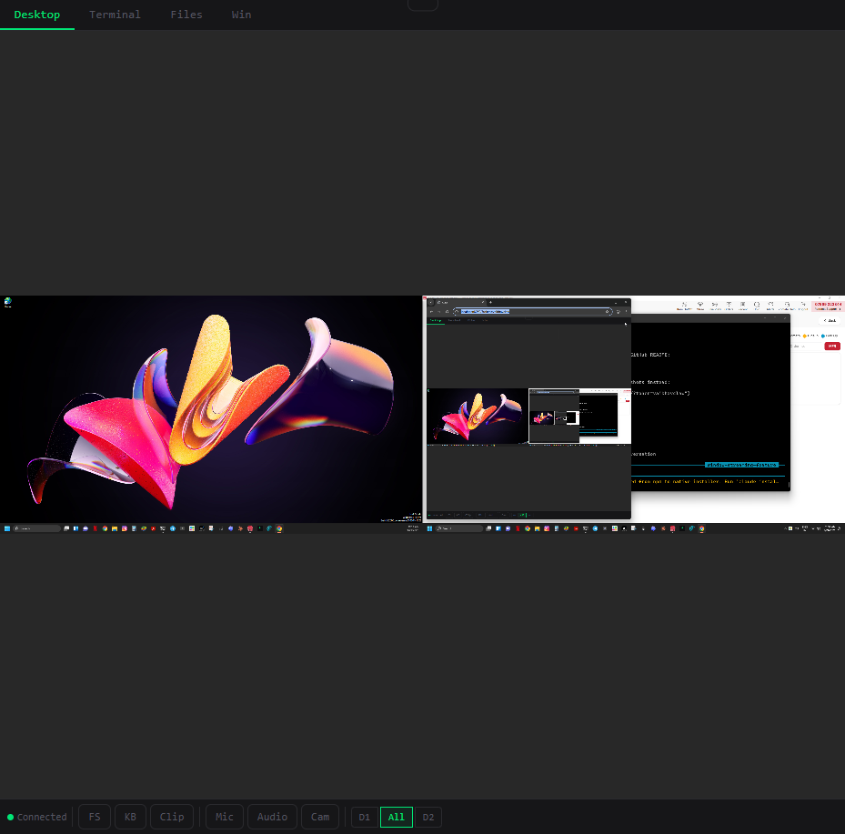
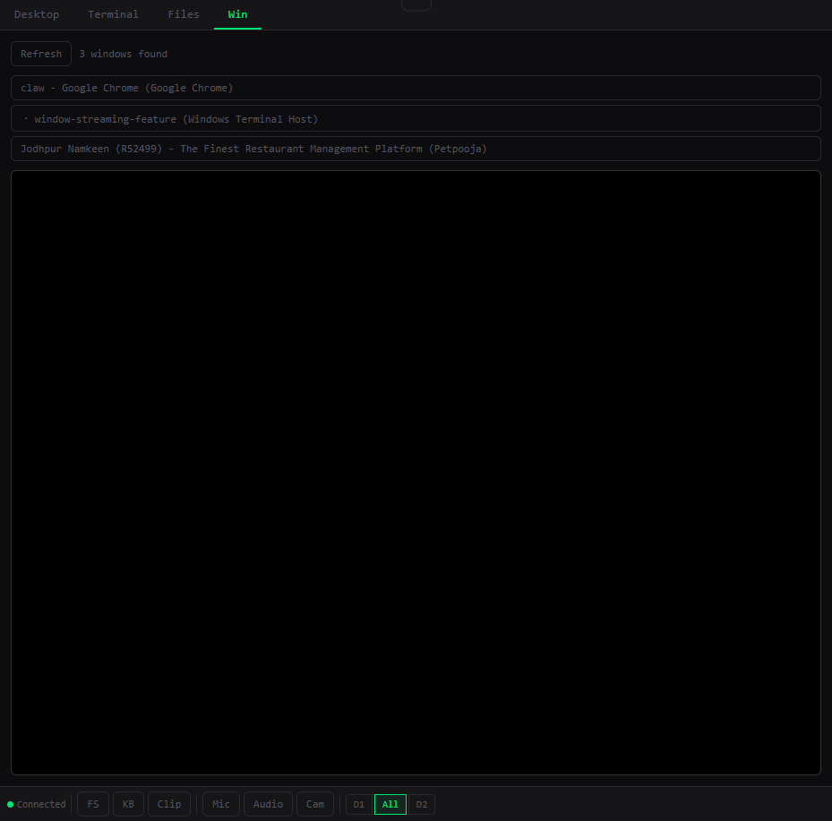
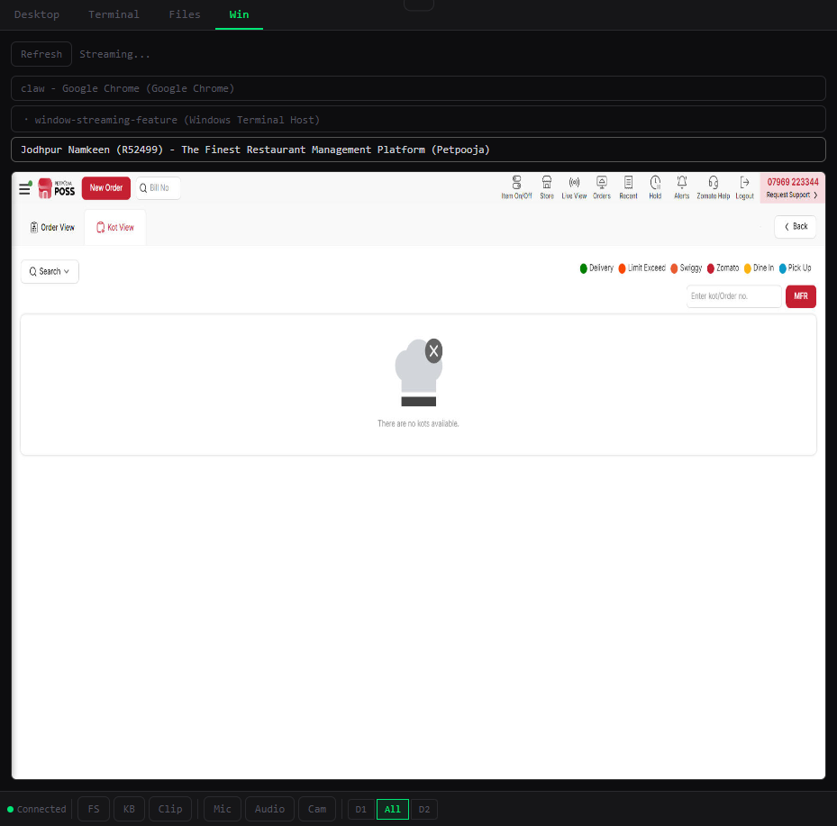
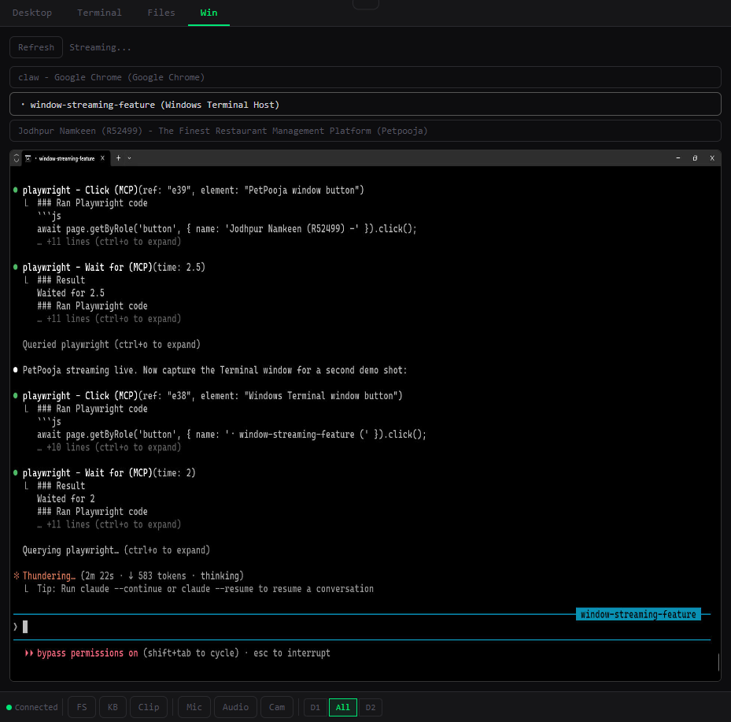

# claw-vnc

Browser-based remote desktop portal for Windows. One tab, all tools — VNC desktop, terminal, file browser, mic/audio/camera relay, and OBS-style **per-window streaming with live mouse & keyboard control**.

Built to run behind [Tailscale](https://tailscale.com/) — zero port-forwarding, secure by default.

---

## Features

| Feature | Description |
|---|---|
| **Desktop (VNC)** | Full remote desktop via noVNC, multi-monitor selector (D1 / All / D2) |
| **Terminal** | Persistent PowerShell session in the browser (xterm.js) |
| **Files** | Upload/download, browse directories |
| **Mic relay** | Browser mic → VB-Cable virtual device |
| **Audio out** | System audio → browser (Stereo Mix / ffmpeg) |
| **Camera** | Browser webcam → MJPEG preview + virtual cam |
| **Win (new)** | Pick any open window → live JPEG stream at ~15 fps + full mouse & keyboard control |

---

## Screenshots

### Desktop tab — full VNC with monitor selector


### Win tab — window list auto-loaded on activation


### Streaming PetPooja (restaurant POS) — isolated, no taskbar noise


### Streaming Windows Terminal — works with any app


---

## Window Streaming (Win tab)

OBS-style per-window capture — stream exactly one app instead of the whole desktop.

**How it works:**
1. Click **Win** tab → window list loads automatically
2. Click any window → live JPEG stream starts in the canvas
3. **Mouse control**: click, right-click, scroll wheel all forwarded to the real window
4. **Keyboard control**: click the canvas to focus, then type normally
5. Switching away from the tab closes the WebSocket cleanly

**Tech stack for this feature:**
- [`node-screenshots`](https://github.com/nashaofu/node-screenshots) — native Rust-based window capture, no native build required
- Persistent PowerShell control process with Win32 P/Invoke for mouse (`mouse_event`) and keyboard (`WScript.Shell SendKeys`) — zero-latency after startup
- `/api/windows` REST endpoint + `/window-stream` WebSocket

---

## Quick Start

### Prerequisites
- Node.js 18+
- [TightVNC Server](https://www.tightvnc.com/) (for Desktop tab)
- [VB-CABLE](https://vb-audio.com/Cable/) (for Mic relay)
- [ffmpeg](https://ffmpeg.org/download.html) (for Audio out)
- Enable **Stereo Mix** in Recording devices (for system audio)

### Run
```bat
cd claw-vnc
start.bat
```

Or with a custom token:
```bat
set CLAW_TOKEN=mysecrettoken
node server.js
```

Open: `http://localhost:8080/?token=<your-token>`

### Tailscale HTTPS
```bash
tailscale serve --bg http://localhost:8080
```

---

## Environment Variables

| Variable | Default | Description |
|---|---|---|
| `PORT` | `8080` | HTTP port |
| `CLAW_TOKEN` | random | Auth token (set for persistence across restarts) |
| `VNC_HOST` | `127.0.0.1` | VNC server host |
| `VNC_PORT` | `5900` | VNC server port |
| `VNC_PASSWORD` | `vaibhavclaw` | VNC password |
| `WIN_MIC_DEVICE` | `CABLE Input (VB-Audio Virtual Cable)` | Virtual mic output device |
| `WIN_AUDIO_DEVICE` | `Stereo Mix` | System audio capture device |

---

## Architecture

```
browser  ──HTTPS──▶  tailscale serve  ──HTTP──▶  node server.js :8080
                                                      │
                     ┌────────────────────────────────┤
                     │  WebSocket routes              │
                     │  /websockify   → VNC proxy     │
                     │  /terminal     → node-pty      │
                     │  /audio-in     → ffmpeg mic    │
                     │  /audio-out    → ffmpeg audio  │
                     │  /camera       → MJPEG relay   │
                     │  /window-stream→ node-screenshots + PS ctrl
                     └────────────────────────────────┘
```

## License

MIT
